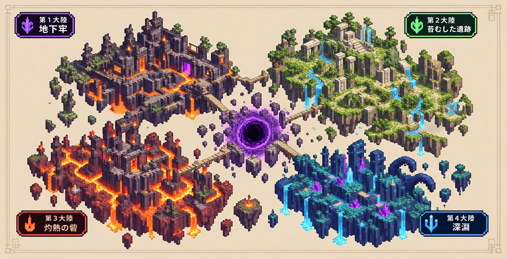

# 攻略ダンジョン（マイクラ統合版アドオン）

ダンジョン専用ワールド。敵を倒すと英単語の問題が出る。即答でコインを稼いで装備を買い、深い階を目指す。間違えるとダメージ（ミスだけでは死なない）。

## 出題形式（瞬間想起）
選択肢から消去法で選ぶのではなく、**英単語を見た瞬間に意味が浮かぶか**を鍛える。
1. 英単語だけが表示される。意味が浮かんだら制限時間（初期3秒）以内に「浮かんだ」を押す。
2. 意味が表示されるので、思い浮かべた意味と合っていたかを「○／×」で答える。
- 2秒以内に○ → **即答**。覚え具合が上がり、コンボが続く。
- 2秒より遅い○ → 正解だが覚え具合は上がらない（即答できるまで出し続ける）。
- ×・わからない・時間切れ → ミス。ダメージを受けて「苦手」に戻る。
- 設定で4択形式にも戻せる。
苦手な単語ほどよく出て、苦手単語を持った敵は赤い名前で、強化されて出てくる。

## 入れ方（Windows）
1. `.mcaddon` をダブルクリック → マイクラが開いて取り込まれる（ビヘイビアパックとリソースパックの2つが入る）。
2. **新しいワールドを「フラット」で作る**。「ビヘイビアパック」で「攻略ダンジョン」を有効にする（リソースパックも自動で付く）。
   - 実験的機能はONにしなくていい。アドオンを入れたワールドでは実績が解除されなくなる。
3. ワールドに入ると、その場所に**キャンプ**が自動で建つ。ルールも自動で設定される（アドベンチャーモード、自然に湧く敵なし、昼で固定、死んでもアイテムが消えない、空腹なし）。

## キャンプ（ロビー）
床の色に乗るとメニューが開く。
- **黒（北）**：ダンジョン。挑戦する階を選ぶ
- **金（東）**：ショップ。武器・防具・回復アイテムと、見た目アイテム（称号・名前の色・エフェクト・ペット）
- **青（西）**：ミッション。デイリー、やり込み、バッジ、自己ベスト
- **紫（南）**：単語の書。セットアップ、単語テスト、成績、図鑑（階ごとの100語の覚え具合・倒した敵）、設定
- **鉄（東の南寄り）**：鍛冶屋。手に持った武器・防具をコインで強化（鋭さ・射撃・ダメージ軽減・耐久など）。強化するほど名前の色がレアになり、耐久も全回復する。

南の壁（単語の書の上）には、大きな世界地図のボード（12×6マス）が飾ってある。

攻略コンパス（右クリック）からも同じメニューが開く。倒れたらキャンプに戻る。

## ダンジョン（階層式・ローグライク）
- **1階 = 単語100語**。ターゲット1900なら全19階：1〜8階がPart1、9〜15階がPart2、16〜19階がPart3。20階から先は「無限の深淵」（全単語、苦手優先）。その階で出る単語はその100語だけ。
- **単語シールド**：敵はシールド（ダメージ80%カット）を持っている。最初に攻撃するとその敵の単語が出題され、即答ならシールドが割れて敵が弱る。ミスすると敵が強くなり、3秒後に挑み直せる。→ その階の単語を覚えていれば楽勝、覚えていなければ苦戦する。
- 階の選択画面に、その階の単語の**習熟度（★と％）**が出る。
- キャンプの東にダンジョン置き場があって、階に入るたびに部屋の並びと種類をランダムで作り直す。1階は4部屋＋門番、深いほど増える（最大8部屋＋門番）。
- **雰囲気が段階で変わる**（世界地図に合わせて、床のガラスの下を溶岩や水が流れる）：地下牢（1〜4階）→ 苔むした遺跡（5〜8階）→ 灼熱の砦（9〜15階）→ 深淵（16〜19階）→ 無限の深淵（20階〜）。敵も強くなる。
- **部屋の種類**
  - 戦いの間：敵を全員倒すと扉が開く。
  - 精鋭の間：強化された精鋭がいる。コイン2倍。
  - 宝物庫：中央の宝箱でコイン・金のリンゴ・祝福のどれか。
  - 癒しの泉：中央に触れるとHP全回復と守りの加護。
  - 単語の祭壇：5問連続（ダメージなし）。全問即答なら祝福。
  - 門番の間：門番のHPが2/3と1/3を切るたびに「門番の問い」。正解で門番がひるみ、ミスで門番が回復する。倒したら5問の試練。
- **祝福**：戦いの間・精鋭の間を突破するたびに3つから1つ選ぶ（剛力・疾風・鉄壁・再生・守護・錬金・吸血・熱狂、各Lv3まで）。続けて次の階に潜ると引き継がれ、キャンプに戻るか倒れると消える。
- **フィーバー**：即答で10コンボ（熱狂の祝福で短くなる）するとフィーバー。20秒間、コイン2倍で、攻撃と速さが上がる。
- **ランク**：階のクリア時に、即答率と時間でS〜Cのランクとボーナスコイン。
- **PC向け**：Shiftを2回すばやく押すと、どこでもメニューが開く。
- **例文問題**：精鋭のシールド、門番の問い、門番の試練（偶数問目）、単語の祭壇では、ターゲットの例文の穴埋め（和訳つき）で出題する。制限時間は2.5秒長い。設定でOFFにできる。
- **空気感**：大陸ごとに霧の色と濃さが変わり、灰・胞子・火の粉などが漂う。天井から鎖・根・つるが垂れる。
- **ボス登場の演出**：門番とレイドボスの登場時に、カメラがボスに寄る。
- **HUD**：画面右に、階・部屋・コンボ・フィーバーの残り・祝福・コイン・Lvを常に表示（設定でOFFにできる）。

## 4つの大陸とレイドボス


| 大陸 | 階 | 単語 | レイドボス |
|---|---|---|---|
| 第1大陸 地下牢 | 1〜4階 | No.1〜400 | 獄王ヴォカブ（檻のかぶとの看守） |
| 第2大陸 苔むした遺跡 | 5〜8階 | No.401〜800 | 苔の巨像レキシス（背中に滝の大ガエル） |
| 第3大陸 灼熱の砦 | 9〜15階 | No.801〜1500 | 炎帝グロッサ（燃える包丁の豚の料理長） |
| 第4大陸 深淵 | 16〜19階 | No.1501〜1900 | 深淵の主ディクシオ（結晶を生やしたクラーケン） |
| 最終決戦 言霊の玉座 | － | 全単語 | 言霊の魔王ロゴス（大鎌の骸骨の王） |
| 無限の深淵 | 20階〜 | 全単語 | － |

- 大陸の最後の階をクリアすると、その大陸のレイドボスに挑める。**倒さないと次の大陸に進めない。**
- レイドボスは大陸の**全単語**を出題し、全部を即答するまで倒れない（名前の下のゲージ＝残りの単語数）。苦手な単語から先に出る。
- 10問ごとに、ミスした数だけ眷属（単語シールド付き）が現れる。全部倒すと次の10問。
- 途中でやめても倒れても、即答した単語は記録が残る。次はその続きから。
- 倒した大陸のレイドボスには「再戦」できる（全単語の総復習）。
- 4大陸を制覇すると**最終決戦**。言霊の魔王ロゴスが全1900語を出題する。倒すと無限の深淵が開く。
- ボスの見た目は描いてもらった絵をもとにしたオリジナルのモデル（`tools/boss_models.py` で作る）。攻撃は効かず、即答だけが効く。

## ミッション・実績
ICE BOW のキットの仕組み（青い床／コンパスの「やり込み」）。
- **デイリー**：今日の30問、今日の即答10回、今日の攻略（部屋3つ）、今日の盾砕き（シールド20枚）
- **ミッション**：最初の正解、百問斬り、千問斬り、電光石火（即答50回）、部屋荒らし、門番キラー、語彙の番人（300語）、20コンボ、盾砕き（シールド100枚）、Sランカー（S5回）、第1〜第4大陸 制覇、完全制覇（最終決戦）
- **バッジ**：ミッションで手に入る。名前の横に3つまで付けられる。
- **レベル**、**自己ベスト**、**ログインボーナス**（連続日数で増える）

## コイン
即答 +3、遅い正解 +1、5コンボ +10、部屋クリア +15、門番撃破 +50。ほかに、デイリーミッションとログインボーナスでももらえる。ミスしても減らない。

## 単語の書のメニュー
- **セットアップ**：英単語を100語ずつ表示するので、知らない・自信がない単語だけONにする。ONは「苦手」（よく出る、敵の名前が赤い）、OFFは「分かる」（たまに確認で出る）。範囲は「出題範囲」の単語だけ。
- **単語テスト（10問）**：ダメージなし。コインはもらえる。
- **成績**：正答率、ベストコンボ、覚えた単語数、苦手TOP10。
- **設定**：出題範囲（Part1／Part1〜2／Part2／Part3／全部）、出題形式（瞬間想起／4択）、制限時間（2〜5秒）、ミスのダメージ量。

## 単語の入れ替え（Ankiから）
1. パソコン版Ankiで「ファイル」→「書き出す」。
2. 形式を「**ノートをプレーンテキストで（.txt）**」にして、デッキを選ぶ。
3. 「HTMLとメディアへの参照を含める」のチェックを外して書き出す（音声や画像は入らないので数百KBになる）。
4. できた .txt を渡してもらえれば、こっちで変換する：
   ```
   python3 tools/anki_to_words.py deck.txt --preview            # 列の確認
   python3 tools/anki_to_words.py deck.txt --word 4 --meaning 6 --num 16 --cloze 17 --ex-ja 8  # ターゲット1900（例文つき）
   python3 tools/build.py                                        # private/ に .mcaddon を作る
   ```
   単語帳のデータは公開リポジトリに載せないよう、`private/`（git管理外）に置く。
   単語を入れ替えても、覚え具合の記録は単語ごとに残る。

## 更新するとき
統合版は、同じバージョンのアドオンを2回取り込むとエラーになる。だから更新のたびに `manifest.json` のバージョンを上げる（1.0.0 → 1.1.0 → …）。
新しい版を取り込んだら、ワールドの「編集」→「ビヘイビアパック」で「攻略ダンジョン」が有効になっているか確認する。記録はワールドに残るので消えない。

## 仕組みメモ
- マイクラのフォントに無い文字（全角スペース、✗ など）は文字化けするので使わない。
- 記録はワールドの中に保存される（ワールドごとに別）。
- 4択形式のハズレには、正解と意味が重なる単語（例：crucial と vital）を使わない。
- やり込み（コイン、ミッション、バッジ、レベル、ショップ、ペット）は ICE BOW のキット（`scripts/yarikomi.js`、`shop.js`、`pets.js`、`kouryaku_rp/`）。説明は `ICEBOW_yarikomi.md`。
- スクリプトAPI：`@minecraft/server` 2.0.0 / `@minecraft/server-ui` 2.0.0（安定版のみ）。
